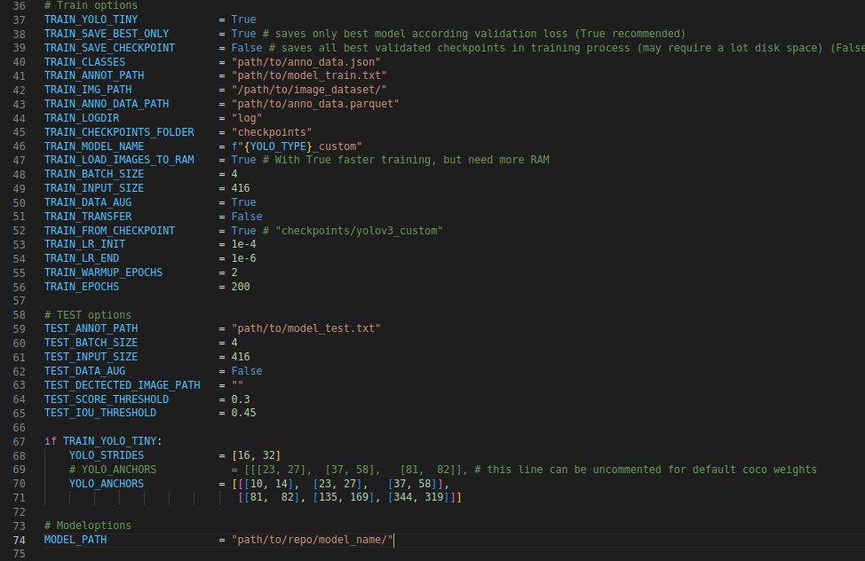

# LOST yolo v3 tf2

## About
Adaptions of pylessons repo for yolo training (https://github.com/pythonlessons/TensorFlow-2.x-YOLOv3)

## Description
This Repo is used to train a tiny YOLO V4 model to use it with [lost_semi_auto_pipes](https://github.com/l3p-cv/lost_semi_auto_pipes) Repo.
The description and the default options are only to train a tiny YOLO V4 model. To train an other model
look at the pylessons link above.

## Installation
First, clone or download this GitHub repository and install requirements.
```
pip install -r ./requirements.txt
```


## Data
To train the model you need:
*   annotation data as parquet file
*   train classes as json file

You get both data after the first iteration of the lost semi auto pipe.

directory structure:
```
.
├── Images
├── anno_data
│   ├── anno_data_0.parquet
│   ├── anno_data_1.parquet
├── checkpoints
│   ├── checkpoint
│   ├── yolov4_custom_Tiny.data-00000-of-00001
│   └── yolov4_custom_Tiny.index
├── log
├── mAP
│   ├── ground-truth
│   └── results.txt
├── model_data
│   ├── coco
│   │   ├── coco.names
│   │   └── coco_names.json
│   ├── anno_data.json
│   ├── model_test.txt
│   ├── model_train.txt
│   ├── yolov3-tiny.weights
│   └── yolov4-tiny.weights
├── yolov3
│   ├── __ init __.py
│   ├── configs.py
│   ├── dataset.py
│   ├── utils.py
│   ├── yolov3.py
│   └── yolov4.py
├── LICENSE
├── README.md
├── convert_parquet_to_yolo.py
├── convert_to_pb.py
├── evaluate_mAP.py
├── requirements.txt
└── train.py
```

## Edit the configs

To train your model, edit the [config.py](yolov3/configs.py)



* [line 40:](yolov3/configs.py#L40) Path and name of the train classes json file.
* [line 41:](yolov3/configs.py#L41) Path and name of model training data. This file and directory is creating <br> by [convert_parquet_to_yolo.py](convert_parquet_to_yolo.py) and will call to train the model
* [line 42:](yolov3/configs.py#L42) Path of the image dataset
* [line 43:](yolov3/configs.py#L43) Path of annotation data parquet file. Create this folder for all your annotation parquet files.
* [line 51:](yolov3/configs.py#L51) If it is the first training of the model set it true else false
* [line 52:](yolov3/configs.py#L52) If it is the first training of the model set it false else true
* [line 56:](yolov3/configs.py#L56) Choose the number of training epochs.
* [line 59:](yolov3/configs.py#L59) Path and name of model test data. This file and directory is creating <br> by [convert_parquet_to_yolo.py](convert_parquet_to_yolo.py) and will call to validate the model after training
* [line 74:](yolov3/configs.py#L59) Path of your model repo. The target folder has to be the name of your model.

## Training process

1. download anno_data.json and anno_data.parquet from [lost_semi_auto_pipes](https://github.com/l3p-cv/lost_semi_auto_pipes)
2. load anno_data.json into your choosen [directory](yolov3/configs.py#L40)
   * you only have to update the anno data json if there is a change since the last training
3. load or add your anno_data.parquet into your created [directory](yolov3/configs.py#L43)
4. run [convert_parquet_to_yolo.py](convert_parquet_to_yolo.py)
   * builds a list of all anno data parquet in the directory
   * train.txt and test.txt will created
5. run [train.py](train.py)
   * train the model and save best model at the checkpoints directory
   * saves only best model according validation loss
6. run [convert_to_pb.py](convert_parquet_to_yolo.py)
   * save the model as a TensorFlow model
   * use the weights from checkpoint
   * check the model directory for older versions
   * save the new model version with one counter higher as the version befor

